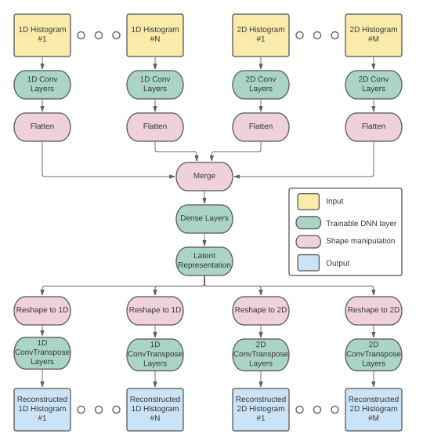
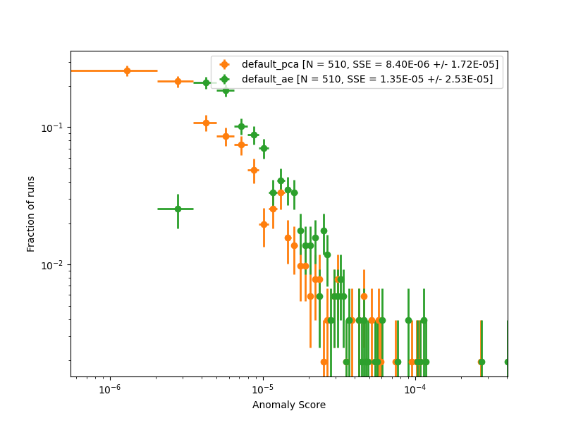
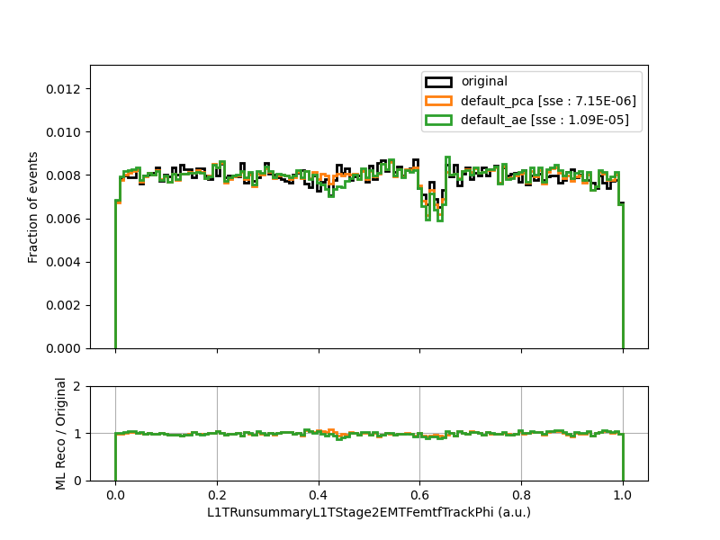
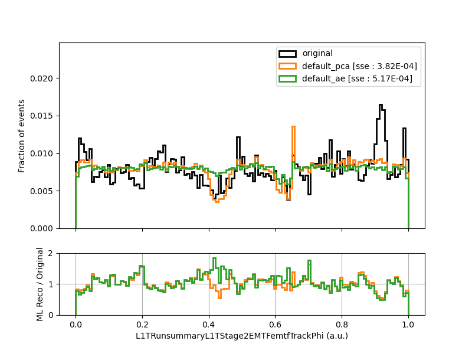
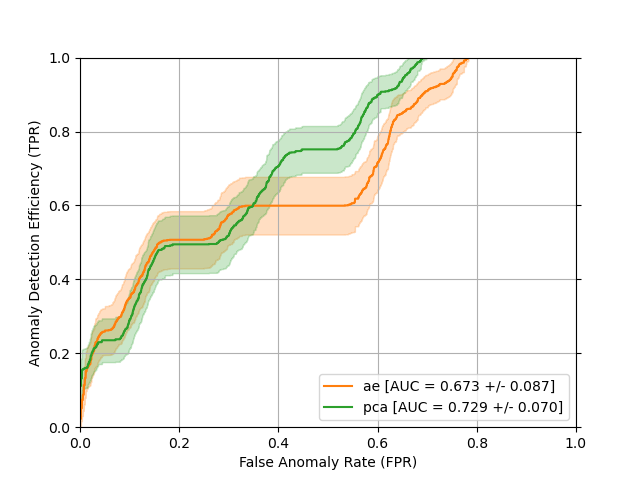
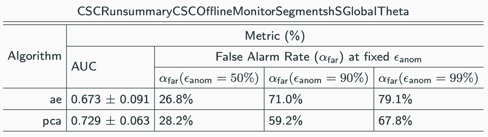
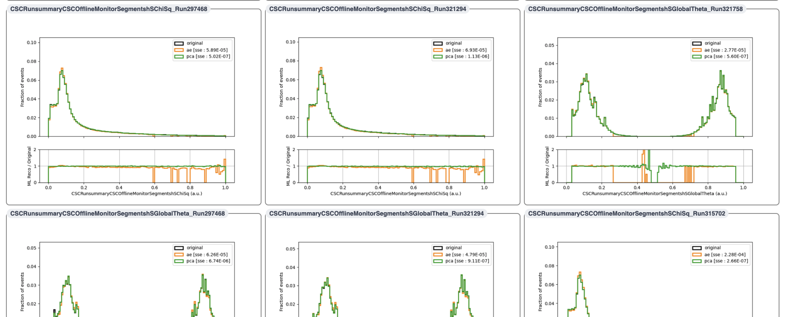

# Introduction
Welcome to the AutoDQM ML user tutorial! The [AutoDQM_ML](https://github.com/AutoDQM/AutoDQM_ML) repository is a toolkit for developing machine learning algorithms to detect anomalies in offline DQM histograms.

With this tool, you can do the following:
1. Grab data from DQM histograms of interest on `/eos` and write to a single `pandas dataframe`.
2. Train machine learning algorithms that can be used for anomaly detection.
3. Compare the performance of these ML algorithms and statistical tests.

Table of Contents
=================

* [Introduction](#introduction)
* [Setup](#setup)
* [Using the tool](#using-the-tool)
   * [1. Fetching Data](#1-fetching-data)
   * [2. Training ML Algorithms](#2-training-ml-algorithms)
      * [2.1 Introduction](#21-introduction)
      * [2.2 Statistical Tests](#22-statistical-tests)
      * [2.3 Principal Component Analysis (PCA)](#23-principal-component-analysis-pca)
      * [2.4 Autoencoders](#24-autoencoders)
   * [3. Assessing Performance of ML Algorithms](#3-assessing-performance-of-ml-algorithms)
      * [Quantitative Assessment of Anomaly Detection Algorithms](#quantitative-assessment-of-anomaly-detection-algorithms)

Created by [gh-md-toc](https://github.com/ekalinin/github-markdown-toc)

# Setup
**1. Clone repository**
```
git clone https://github.com/AutoDQM/AutoDQM_ML.git
cd AutoDQM_ML
```
**2. Install dependencies**

Dependencies are listed in ```environment.yml``` and installed using `conda`. `conda` is a package and environment management system, see [documentation](https://docs.conda.io/en/latest/) for more details.

If you do not already have `conda` set up on your system, you can install (for linux) with:
```
curl -O -L https://repo.anaconda.com/miniconda/Miniconda3-latest-Linux-x86_64.sh
bash Miniconda3-latest-Linux-x86_64.sh -b
```
You can then set `conda` to be available upon login with
```
~/miniconda3/bin/conda init # adds conda setup to your ~/.bashrc, so relogin after executing this line
```

Once `conda` is installed and set up, install dependencies with
```
conda env create -f environment.yml
```

Then activate your environment to finish installing all packages.
```
conda activate autodqm-ml
```

Some packages cannot be installed via `conda` or take too long and need to be installed with `pip`.
```
pip install yahist
pip install tensorflow==2.5
```
If `tensorflow==2.5` is not available, `tensorflow==2.11.0` works.

Note: if you are running on `lxplus`, it may also be advisable to specify the installation location in your work or `/eos` area by including the installation path in the above command with `-p /afs/cern.ch/work/...`, as the resulting environment will be several GB in size.

Note: if you are running on `lxplus`, you may run into permissions errors, which may be fixed with:
```
chmod 755 -R /afs/cern.ch/user/s/<your_user_name>/.conda
```
and then rerunning the command to create the `conda` env.

**3. Install autodqm-ml**

Install with:
```
pip install -e .
```
*Note: if you were to edit the architecture of the ML models (e.g. autodqm_ml/algorithms/anomaly_detection_algorithm.py, pca.py, etc.), you may have to "recompile" the code again using the above command.*

Once your setup is installed, you can activate your python environment with
```
conda activate autodqm-ml
```

**Note**: `CMSSW` environments can interfere with `conda` environments. Recommended to unset your CMSSW environment (if any) by running
```
eval `scram unsetenv -sh`
```
before attempting installation and each time before activating the `conda` environment.

# Using the tool

## 1. Fetching Data
The first step in developing anomaly detection algorithms is fetching the data with which we want to train and assess our algorithms.

The [`scripts/fetch_data.py`](https://github.com/AutoDQM/AutoDQM_ML/blob/main/scripts/fetch_data.py) script can be used to do this. It is essentially a wrapper to the `autodqm_ml.data_prep.data_fetcher.DataFetcher` class. 

There are 3 main command line arguments to pay attention to when using this script.

First, the `--tag` argument should be given a `str` input which will be included in your output file names.

Second, the `--contents` option should be given a `str` input which is a path to a `json` file indicating which histograms you would like to fetch data for. Here is a "contents" `json` file for grabbing a small set of histograms from the CSC and EMTF subsystems:
```json
{
    "CSC": [
        "/Run summary/CSCOfflineMonitor/Occupancy/hORecHits",
        "/Run summary/CSCOfflineMonitor/Occupancy/hOSegments",
        "/Run summary/CSCOfflineMonitor/Segments/hSTimeCombinedSerial",
        "/Run summary/CSCOfflineMonitor/Segments/hSTimeVsTOF",
        "/Run summary/CSCOfflineMonitor/Segments/hSTimeVsZ"
    ],
    "L1T" : [
        "/Run summary/L1TStage2EMTF/emtfTrackBX",
        "/Run summary/L1TStage2EMTF/emtfTrackEta",
        "/Run summary/L1TStage2EMTF/emtfTrackOccupancy",
        "/Run summary/L1TStage2EMTF/emtfTrackPhi",
        "/Run summary/L1TStage2EMTF/emtfTrackQualityVsMode"
    ]
}
``` 
Each key in the "contents" `json` should correspond to a subsystem directory and the corresponding value should be a list of histograms, given as the relative path within the `root` file starting from the subsystem directory.

Third, the `--datasets` option should be given a `str` input which is a path to a `json` file indicating which primary datasets, years, productions, eras and/or years you would like to grab histograms for. As an example, consider the following "datasets" `json`:
```json
{
    "primary_datasets" : ["SingleMuon"],
    "years" : {
        "2017" : {
            "productions" : ["UL2017"],
            "eras" : ["B"]
        },
        "2018" : {
            "productions" : ["UL2018"],
            "runs" : ["317488", "317481"]
        }
    }
}
``` 
This will find all DQM files for the `SingleMuon` PDs from 2017 and 2018. For 2017/2018 only files with the substring `"UL2017"`/`"UL2018"` will be considered, and for 2017 only era B ("Run2017B") will be considered, while for 2018, only runs `317488` and `317481` will be considered. 

One could also at this point specify a list of runs to mark as either "good" (not anomalous) or "bad" (anomalous), by adding the following to your "datasets" `json`:
```json
{
    "2018" : {
            "productions" : ["UL2018"],
            "runs" : ["317488", "317481"],
            "bad_runs" : ["317488"],
            "good_runs" : ["317481"]
        }
}
```
If at least one of "bad_runs" or "good_runs" is specified, a field "label" will be added to your output dataframe, with a value of 1 for bad runs and a value of 0 for good runs. If both "bad_runs" and "good_runs" are specified, any runs not specified in either list will be assigned a "label" of -1. If only one of "bad_runs" or "good_runs" is specified, all runs not explicitly listed as good (bad) will be assigned a value corresponding to bad (good).

Note that it is recommended that the paths to the "contents" and "datasets" `json` files should be given either as the full absolute path or as relative paths under `AutoDQM_ML`. For example, if my file was located in
```
/<path_to_AutoDQM_ML>/AutoDQM_ML/configs/datasets.json
```
I should pass this to `fetch_data.py` as
```
--datasets "configs/datasets.json"
```
You could also specify it as a relative path to your current directory, for example,
```
--datasets "../configs/datasets.json"
```
but the same command will not be guaranteed to work if you run the script from inside a different directory.

To get started, you can run the following command to fetch DQM histograms for the CSC and EMTF subsystems from the 2017 and 2018 UL SingleMuon datasets:
```
python scripts/fetch_data.py --output_dir "tutorial" --contents "metadata/histogram_lists/csc_emtf.json" --datasets "metadata/dataset_lists/SingleMuon_UL1718.json"
```
The script will print out a summary of the histograms and datasets we are grabbing:
```
INFO     [DataFetcher : run] Running DataFetcher to grab the following set of subsystems and        data_fetcher.py:79
         histograms
INFO              Subsystem: CSC                                                                    data_fetcher.py:81
INFO              Histograms:                                                                       data_fetcher.py:82
INFO                      /Run summary/CSCOfflineMonitor/Occupancy/hORecHits                        data_fetcher.py:84
INFO                      /Run summary/CSCOfflineMonitor/Occupancy/hOSegments                       data_fetcher.py:84
INFO                      /Run summary/CSCOfflineMonitor/Segments/hSTimeCombinedSerial              data_fetcher.py:84
INFO                      /Run summary/CSCOfflineMonitor/Segments/hSTimeVsTOF                       data_fetcher.py:84
INFO                      /Run summary/CSCOfflineMonitor/Segments/hSTimeVsZ                         data_fetcher.py:84
INFO              Subsystem: L1T                                                                    data_fetcher.py:81
INFO              Histograms:                                                                       data_fetcher.py:82
INFO                      /Run summary/L1TStage2EMTF/emtfTrackBX                                    data_fetcher.py:84
INFO                      /Run summary/L1TStage2EMTF/emtfTrackEta                                   data_fetcher.py:84
INFO                      /Run summary/L1TStage2EMTF/emtfTrackOccupancy                             data_fetcher.py:84
INFO                      /Run summary/L1TStage2EMTF/emtfTrackPhi                                   data_fetcher.py:84
INFO                      /Run summary/L1TStage2EMTF/emtfTrackQualityVsMode                         data_fetcher.py:84
INFO              for the following years dict_keys(['2017', '2018'])                               data_fetcher.py:85
INFO              and for the following primary datasets ['SingleMuon']                             data_fetcher.py:86
INFO     [DataFetcher : run] Grabbing histograms for the following years: dict_keys(['2017',        data_fetcher.py:88
         '2018'])
INFO     Year: 2017                                                                                 data_fetcher.py:90
INFO              productions: ['UL2017']                                                           data_fetcher.py:91
INFO              specified eras: None                                                              data_fetcher.py:92
INFO              specified runs: None                                                              data_fetcher.py:93
INFO     Year: 2018                                                                                 data_fetcher.py:90
INFO              productions: ['UL2018']                                                           data_fetcher.py:91
INFO              specified eras: None                                                              data_fetcher.py:92
INFO              specified runs: None                                                              data_fetcher.py:93
```
It will give printouts about its current task and progress:
```
INFO     [DataFetcher : extract_data] Loading histograms for pd 'SingleMuon' and year '2018' from  data_fetcher.py:211
         495 total files.
  1%|▍                                                                                | 3/495 [00:00<01:43,  4.76it/s]
```
And will let us know if it encounters any problematic files (by default, it will just skip these):
```
WARNING  [DataFetcher : load_data] Problem loading file 'root://eoscms.cern.ch//eos/cms/store/grou data_fetcher.py:262
         p/comm_dqm/DQMGUI_data/Run2018/SingleMuon/R0003152xx/DQM_V0001_R000315267__SingleMuon__Ru
         n2018A-12Nov2019_UL2018-v2__DQMIO.root', it might be corrupted. We will just skip this
         file.
```

When it finishes, this will give us an output file `tutorial/SingleMuon.parquet` which contains all of the specified histograms.

Note: `scripts/fetch_data.py` tends to run much faster on `lxplus` as its much quicker to read files from `/eos` on `lxplus` than from other sites (especially if they are far away).

Note: if you are trying to grab a large number of histograms, the resulting `parquet` file may be very large and you may run out of memory when merging files. If you run into this issue, you can work around it by splitting up your `contents` config file into several files and running `fetch_data.py` once for each one.

The `parquet` [format](https://parquet.apache.org/) provides a highly compressed columnar data representation which is an efficient way to store our histograms.

We can explore this file in the `python` interpreter. We could load it as a `pandas` dataframe:
```
>>> import pandas
>>> df = pandas.read_parquet("tutorial/SingleMuon.parquet")
>>> df.columns
Index(['run_number', 'year', 'label',
       'CSC//Run summary/CSCOfflineMonitor/Occupancy/hORecHits',
       'CSC//Run summary/CSCOfflineMonitor/Occupancy/hOSegments',
       'CSC//Run summary/CSCOfflineMonitor/Segments/hSTimeCombinedSerial',
       'CSC//Run summary/CSCOfflineMonitor/Segments/hSTimeVsTOF',
       'CSC//Run summary/CSCOfflineMonitor/Segments/hSTimeVsZ',
       'L1T//Run summary/L1TStage2EMTF/emtfTrackBX',
       'L1T//Run summary/L1TStage2EMTF/emtfTrackEta',
       'L1T//Run summary/L1TStage2EMTF/emtfTrackOccupancy',
       'L1T//Run summary/L1TStage2EMTF/emtfTrackPhi',
       'L1T//Run summary/L1TStage2EMTF/emtfTrackQualityVsMode'],
      dtype='object')
```
or as an `awkward` array:
```
>>> import awkward
>>> histograms = awkward.from_parquet("tutorial/SingleMuon.parquet")
>>> histograms.fields
['run_number', 'year', 'label', 'CSC//Run summary/CSCOfflineMonitor/Occupancy/hORecHits', 'CSC//Run summary/CSCOfflineMonitor/Occupancy/hOSegments', 'CSC//Run summary/CSCOfflineMonitor/Segments/hSTimeCombinedSerial', 'CSC//Run summary/CSCOfflineMonitor/Segments/hSTimeVsTOF', 'CSC//Run summary/CSCOfflineMonitor/Segments/hSTimeVsZ', 'L1T//Run summary/L1TStage2EMTF/emtfTrackBX', 'L1T//Run summary/L1TStage2EMTF/emtfTrackEta', 'L1T//Run summary/L1TStage2EMTF/emtfTrackOccupancy', 'L1T//Run summary/L1TStage2EMTF/emtfTrackPhi', 'L1T//Run summary/L1TStage2EMTF/emtfTrackQualityVsMode']
```
with `awkward`, we can perform fast vectorized calculations over the full sets of histograms. For example, to see how many entries are in a given histogram for each run,
```
>>> awkward.sum(histograms["L1T//Run summary/L1TStage2EMTF/emtfTrackEta"], axis = -1)
<Array [1.13e+05, 1.13e+05, ... 4.49e+04] type='1059 * float64'>
``` 
to see the number of bins:
```
>>> awkward.count(histograms["L1T//Run summary/L1TStage2EMTF/emtfTrackEta"],axis=-1)
<Array [100, 100, 100, 100, ... 100, 100, 100] type='1059 * int64'>
>>> awkward.count(histograms["L1T//Run summary/L1TStage2EMTF/emtfTrackPhi"],axis=-1)
<Array [126, 126, 126, 126, ... 126, 126, 126] type='1059 * int64'>
```
to get the bin from each run with the highest number of entries and the number of entries for that bin:
```
>>> awkward.argmax(histograms["L1T//Run summary/L1TStage2EMTF/emtfTrackPhi"],axis=-1)
<Array [82, 82, 82, 82, 82, ... 68, 68, 68, 26] type='1059 * ?int64'>
>>> awkward.max(histograms["L1T//Run summary/L1TStage2EMTF/emtfTrackPhi"],axis=-1)
<Array [1.92e+03, 1.92e+03, ... 3.79e+03, 402] type='1059 * ?float64'>
```

We can next use this `parquet` file to train some ML algorithms.

## 2. Training ML Algorithms
In using ML algorithms for anomaly detection with DQM histograms, we make the following assumption:
- A given DQM histogram can be nearly completely characterized by a small number of variables (small in comparison to the total number of bins of the histogram).

We can train a PCA or an autoencoder to learn a transformation from the high-dimensional input space (DQM histogram) to a low dimensional space, a "latent space", which nearly fully characterizes the original input in the high-dimensional space. We can quantify how well the latent space describes the histogram in the following way:
- Transform histogram to latent representation
- Reconstruct histogram from latent representation
- Compare the difference between the original and reconstructed histograms

In the case of the AutoEncoder, the default loss function used in training is the mean-squared error between the original histogram and the histogram reconstructed in the latent space.

Assuming we are able to construct an ML algorithm to do a satisfactory job at this, we make the further assumption that:
- Anomalous histograms will not be well-characterized by their latent space representation and thus their reconstructed histograms will be significantly different from the original histograms. 

### 2.1 Introduction
Having now prepped some DQM data, we can now train some ML algorithms to help us detect anomalies.

For example, assume we have run `scripts/fetch_data.py` as in the previous section and now have an output file:
```
tutorial/SingleMuon.parquet
```
We can train PCAs on some of the histograms in this file with:
```
python scripts/train.py
    --input_file "tutorial/SingleMuon.parquet" 
    --output_dir "tutorial_addMLAlgos" 
    --algorithm "pca"
    --tag "default_pca" # this will identify saved model files and branches added to the histograms file
    --histograms "L1T//Run summary/L1TStage2EMTF/emtfTrackPhi,L1T//Run summary/L1TStage2EMTF/emtfTrackEta" 
    --debug
```
The `scripts/train.py` script will do the following:
1. Load histograms from `"output/test_SingleMuon.parquet"`, normalize the histograms, remove any runs with low statistics, and split them into training/testing sets.
2. Train (and save) PCAs for each of the specified histograms. The saved PCA models will be placed in the `output_dir` with the form `"pca_<hist_name>_<tag>"`.
3. Use the trained PCAs to create reconstructed histograms for each specified histogram and for each run.
4. Calculate the sum-of-squared errors (SSE) between the original and reconstructed histogram.
5. Write a new output file in the `output_dir` with fields added for the reconstructions of each histogram and their SSE wrt the original. These fields have the form `<hist_name>_reco_<tag>` and `<hist_name>_score_<tag>`, respectively.

Running the script above, we see low stat histograms are excluded:
```
DEBUG    [anomaly_detection_algorithm : load_data] Removing 84/1059 runs in which   anomaly_detection_algorithm.py:101
         one or more of the requested histograms had less than 10000 entries. 
```
the histograms are normalized:
```
DEBUG    [anomaly_detection_algorithm : load_data] Scaling all entries in histogram anomaly_detection_algorithm.py:116
         'L1T//Run summary/L1TStage2EMTF/emtfTrackPhi' by the sum of total entries.                                   
DEBUG    [anomaly_detection_algorithm : load_data] Scaling all entries in histogram anomaly_detection_algorithm.py:116
         'L1T//Run summary/L1TStage2EMTF/emtfTrackEta' by the sum of total entries.
```
it trains a PCA for each of the 2 histograms we specified:
```
DEBUG    [PCA : train] Training PCA with 2 principal components for histogram 'L1T//Run                     pca.py:106
         summary/L1TStage2EMTF/emtfTrackPhi' with 465 training examples.                                              
DEBUG    [PCA : train] Saving trained PCA to file                                                           pca.py:111
         'tutorial_addMLAlgos/pca_L1TRunsummaryL1TStage2EMTFemtfTrackPhi_default_pca.json'.
```
and a new `parquet` file is saved to this location:
```
INFO     [AnomalyDetectionAlgorithm : save] Saving output with additional fields to anomaly_detection_algorithm.py:157
         file 'tutorial_addMLAlgos/SingleMuon.parquet'.
```
If we open up this file, we can see the new fields which have been added. For each histogram, we have two new fields:
- `histogram_name` + "_score_default_pca"` which gives the SSE between the original and reconstructed histogram
- `histogram_name` + "_reco_default_pca"` which gives the actual reconstructed histogram

```
>>> import awkward
>>> histograms = awkward.from_parquet("tutorial_addMLAlgos/SingleMuon.parquet")
>>> histograms["L1T//Run summary/L1TStage2EMTF/emtfTrackEta_score_default_pca"]
<Array [4.6e-05, 4.6e-05, ... 6.87e-05] type='975 * float64'>
>>> histograms["L1T//Run summary/L1TStage2EMTF/emtfTrackEta_reco_default_pca"]
<Array [[4.58e-20, 0.0223, ... 1.47e-06]] type='975 * var * float64'>
```

If we tried to run the same command again, `AutoDQM_ML` will warn us that trained PCAs alreay exist in the specified output directory with the specified tag and prevent us from overwriting them:
```
WARNING  [PCA : train] A trained PCA already exists for histogram 'L1T//Run                                  pca.py:95
         summary/L1TStage2EMTF/emtfTrackPhi' with tag 'default_pca' at file                                           
         'tutorial_addMLAlgos/pca_L1TRunsummaryL1TStage2EMTFemtfTrackPhi_default_pca.json'. We will load the          
         saved model from the file rather than retraining. If you wish to retrain, please provide a new tag           
         or delete the old outputs.
```

You can also check any of the settings that were used for a given run of `scripts/train.py` through the `json` file that is written to `output_dir`.

Next, we can train AutoEncoders and compare their performance to the PCAs. Rather than having two separate output files for the PCA and the AutoEncoder, we can save the results all in one file by using the output from the previous step:
```
python scripts/train.py
    --input_file "tutorial_addMLAlgos/SingleMuon.parquet" 
    --output_dir "tutorial_addMLAlgos"
    --algorithm "autoencoder"
    --tag "default_ae"
    --histograms "L1T//Run summary/L1TStage2EMTF/emtfTrackPhi,L1T//Run summary/L1TStage2EMTF/emtfTrackEta"
    --debug
```
We can now access both the results of the PCA and the AutoEncoder scores in the output file. In this way, it is possible to chain together the training of multiple different ML algorithms and have results stored in a common place.
By default, one autoencoder is trained for each histogram specified for `scripts/train.py`.
To see how to train a single autoencoder for all histograms, see Sec. 2.4. 

We can also add the results of statistical tests, like a 1d KS-test, through the `scripts/train.py` script:
```
python scripts/train.py
    --input_file "tutorial_addMLAlgos/SingleMuon.parquet" 
    --output_dir "tutorial_addMLAlgos" 
    --algorithm "statistical_tester"
    --tag "ks_test"
    --histograms "L1T//Run summary/L1TStage2EMTF/emtfTrackPhi,L1T//Run summary/L1TStage2EMTF/emtfTrackEta"
    --debug 
```
As statistical tests do not make reconstructions of the original histogram, this will not add fields like `emtfTrackPhi_reco_ks_test`, but will still add fields with the results of the statistical test, e.g. `emtfTrackPhi_score_ks_test`.

A few options for specifying the details of the algorithms are provided through the CLI in `train.py`:
- `--algorithm` specify a statistical test, PCA, or AutoEncoder
- `--histograms` specify the list of histograms to train algorithms for (or simply evaluate, in the case of a statistical test)
- `--n_components` specify the dimensionality of the latent space used for reconstructing histograms (only applicable for ML algorithms)
- `--reference` specify which run should be used as a reference (only applicable for statistical tests)

In general, however, we will want greater control over the specifics of the algorithms we train. For example, we may want to vary the DNN architecture and training strategy for AutoEncoders. 

All command line arguments available to `scripts/train.py` can be alternatively specified through a `json` file (except `--debug`).
The example above for training autoencoders could be specified through a `json` file as:
```json
{
    "name" : "autoencoder",
    "input_file" : "tutorial_addMLAlgos/SingleMuon.parquet",
    "output_dir" : "tutorial_addMLAlgos",
    "tag" : "default_ae",
    "histograms" : "L1T//Run summary/L1TStage2EMTF/emtfTrackPhi,L1T//Run summary/L1TStage2EMTF/emtfTrackEta"
}
```
Saving the above to a file `config.json`, we would then run the training as:
```
python scripts/train.py --algorithm "config.json"
```

Note that if any arguments are specified BOTH through a `json` config AND the command line, precedence will be given to the command line version.
For example,
```
python scripts/train.py --algorithm "config.json" --tag "some_other_tag"
```
would give our autoencoders the tag "some_other_tag", and NOT "default_ae" (as specified in `config.json`).

We will see in Sec. 2.4 how the `json`-style of training allows for specification of advanced options.

### 2.2 Statistical Tests
Advanced options - in progress
### 2.3 Principal Component Analysis (PCA)
Advanced options - in progress
### 2.4 Autoencoders
For autoencoders, the default behavior when passing multiple histograms to `train.py` is to train one autoencoder for each of the histograms (same behavior as PCAs).
However, autoencoders have the ability to reconstruct multiple outputs simultaneously.
There is also an option to train a single autoencoder on all of the histograms you pass, with an architecture as depicted below:



This can be specified by adding the flag
```
--autoencoder_mode "simultaneous"
```
when running `train.py`.

There are a number of hyperparameters that are configurable for autoencoders.
At the time of writing, these hyperparameters and their default options are:
```json
{
        "batch_size" : 16,
        "val_batch_size" : 1024,
        "n_epochs" : 1000,
        "early_stopping" : True,
        "early_stopping_rounds" : 3,
        "n_hidden_layers" : 2,
        "n_nodes" : 25,
        "n_components" : 3,
        "kernel_1d" : 3,
        "kernel_2d" : 3,
        "strides_1d" : 1,
        "strides_2d" : 1,
        "dropout" : 0.0,
        "batch_norm" : False,
        "n_filters" : 8
}
``` 

These can be changed from their default options through the use of a `json` file input to `scripts/train.py`, where new values should be specified in a field `"config"`.
Suppose we want to increase the size of the latent space (`"n_components"`) and the number of nodes in the dense layers leading up to the latent representation (`"n_nodes"`).
Our `json` file would then look like this:
```json
{
    "name" : "autoencoder",
    "config" : {
        "n_nodes" : 50,
        "n_components" : 4
    },
    "tag" : "ae_increased_nodes"
}
```
If we saved this in a file `ae_configs/my_config.json`, we would then pass this to `scripts/train.py` as:
```
python scripts/train.py --algorithm "ae_configs/my_config.json"
```

Note that any hyperparameters that are not specified within the `"config"` field will retain their default values, which are defined in `autodqm_ml.algorithms.autoencoder.DEFAULT_OPTIONS`.

TODO: explanation of various hyperparameters, recommendations for different scenarios.

## 3. Assessing Performance of ML Algorithms
Having trained some ML algorithms to perform anomaly detection, we now want to assess their performance. The `scripts/assess.py` script can make a variety of diagnostic plots and print out useful info towards this.

Picking up from the previous example, we have the results of several anomaly detection algorithms saved in
```
tutorial_addMLAlgos/SingleMuon.parquet
```
We can make plots for this file with:
```
python scripts/assess.py
    --input_file "tutorial_addMLAlgos/SingleMuon.parquet"
    --output_dir "tutorial_addMLAlgos/plots/"
    --histograms "L1T//Run summary/L1TStage2EMTF/emtfTrackPhi"
    --algorithms "default_pca,default_ae"
    --debug
```
where the CLI for `--histograms` is a comma-separated list of histograms for which to make plots and the CLI for `--algorithms` is a comma-separated list of algorithms to consider. We could also leave `--algorithms` blank, in which case the script would automatically infer the algorithms present in `--input_file` and consider all of them.

The `assess.py` script will first print out some diagnostic info about each histogram and each anomaly detection algorithm for that histogram:
```
INFO     [assess.py] For histogram 'L1T//Run summary/L1TStage2EMTF/emtfTrackPhi',      assess.py:118
         algorithm 'default_pca', the mean +/- std anomaly score is: 8.86e-06 +/-                   
         1.94e-05.
INFO     [assess.py] For histogram 'L1T//Run summary/L1TStage2EMTF/emtfTrackPhi',      assess.py:118
         algorithm 'default_ae', the mean +/- std anomaly score is: 1.44e-05 +/-                    
         3.17e-05.  
```
we can see that the PCA achieves slightly lower reconstruction error than the AutoEncoder. The script will also print out the 5 runs with the highest SSE for each algorithm. For the PCA, the first two are:
```
INFO              The runs with the highest anomaly scores are:                        assess.py:120
INFO              Run number : 305040, Anomaly Score : 3.82e-04                        assess.py:122
INFO              Run number : 305044, Anomaly Score : 2.70e-04                        assess.py:122
```
while for the AutoEncoder, the first two are:
```
INFO              The runs with the highest anomaly scores are:                        assess.py:120
INFO              Run number : 305040, Anomaly Score : 5.17e-04                        assess.py:122
INFO              Run number : 320007, Anomaly Score : 4.06e-04                        assess.py:122
```

The script will next make some summary plots:
    - Histograms of the SSE for each input histogram
        - SSE plots are available in algorithm basis and in a runs basis
        - algorithm basis: plot SSE distribution for each algorithm on the same axes. Plots made separately for train/test set and (if labeled runs are present) good/anomalous runs.
        - runs basis: plot SSE distribution for each set of runs (train/test, good/anomalous) on the same axes. Plots made separately for each algorithm.
    - Original vs. reconstructed histograms

Here is the SSE histogram for `emtfTrackPhi`, shown for testing events:



For the plots of original vs. reconstructed histograms, we could supply an argument `--runs` with a comma-separated list of runs to make plots for, e.g.:
```
--runs "305040,320007"
```
If no `--runs` argument is given, the script will randomly pick `N` runs to make plots for. `N` is set to 3 by default and can be set to any number by including the argument `--n_runs <N>`. Since we did not provide the `--runs` argument the first time we ran, the script picked 3 random runs for us. These plots will look something like the plot shown below:



At this point, we may be interested in investigating Run 305040, which had the highest anomaly detection score for both the PCA and the AutoEncoder. To make a plot of the original and reconstructed histograms, we can run
```
python scripts/assess.py
    --input_file "tutorial_addMLAlgos/SingleMuon.parquet"
    --output_dir "tutorail_addMLAlgos/plots/"
    --histograms "L1T//Run summary/L1TStage2EMTF/emtfTrackPhi"
    --algorithms "default_pca,default_ae"
    --runs "305040"
    --debug
```
The plot is shown below:



Indeed there is some very spiky behavior in the original histogram :monocle_face: -- perhaps the PCA and the AutoEncoder are on to something!

Note that the `assess.py` script could be used to simply make plots of the original histograms by specifying `--algorithms ""` (in fact, if no ML algorithms have been added to the `.parquet` file in question, this is the default behavior).

### Quantitative Assessment of Anomaly Detection Algorithms
So far, the outputs we have examined from `scripts/assess.py` are mostly qualitative -- we have seen comparisons of the reconstruction error (SSE) for different algorithms, but how do we tell which algorithm more effectively identifies anomalies?

If labeled runs are present in your `parquet` file (i.e. if you specified a list of `"bad_runs"` and/or `"good_runs"` in your datasets `json` when running `scripts/fetch_data.py`), `assess.py` will do the folllowing:
    - Calculate and plot ROC curves and AUC, with statistical uncertainties, for each histogram x algorithm
    - Calculate a "false alarm rate" for fixed anomaly detection efficiency points (i.e. false positive rate at fixed true positive rate) and print them out to a table which can be pasted into a LaTeX environment.

Examples of ROC curves for a PCA and Autoencoder trained on the `"SegmentshSGlobalTheta"` histogram from the CSC subsystem are shown below:



where the uncertainty bands represent the +/- 1 standard deviation statistical uncertainty, derived by recalculating the ROC curves and AUC with bootstrap resampling.
We can interpret this plot in the following way: the x-axis gives the fraction of events which are not anomalous ("good") with an SSE score greater than or equal to some threshold and the y-axis shows the corresponding fraction of events which **are** anomalous that have an SSE score greater than or equal to that same threshold.
The performance can be summarized into a single number by integrating each curve along the x-axis.
This number is (creatively) called the "area under the curve" and usually abbreviated as AUC.
The AUC can be physically interpreted as the fraction of pairs of positive/negative instances (i.e. pairs of an anomalous run and a good run) which are correctly classified (i.e. anomalous run has higher SSE than good run).
There are many different names that people use for the x- and y-axes, see the [wikipedia](https://en.wikipedia.org/wiki/Receiver_operating_characteristic) page for more info. 

AUC is a useful metric, but in practice, we may want to use an algorithm in the following context:
- I want to catch 95% (arbitrary) of anomalies. What fraction of good runs will ring a false alarm bell?

The following table is useful for answering this type of question:



Finally, if the directory you specified for `--output_dir` is accessible from a web browser, you can also specify the option `--make_webpage` to get a browsable + searchable webpage of your plots like the one shown below.




